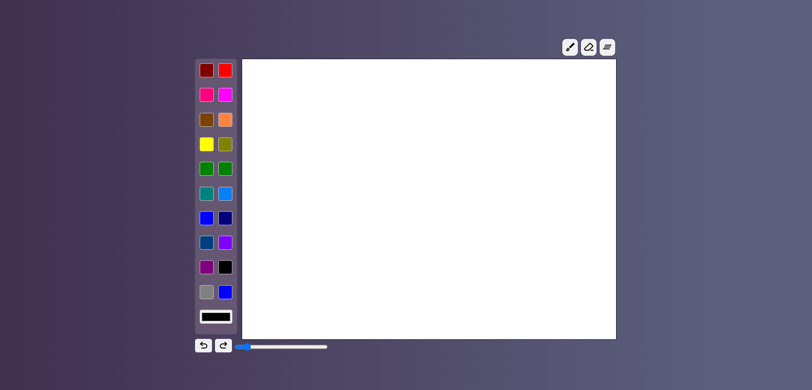
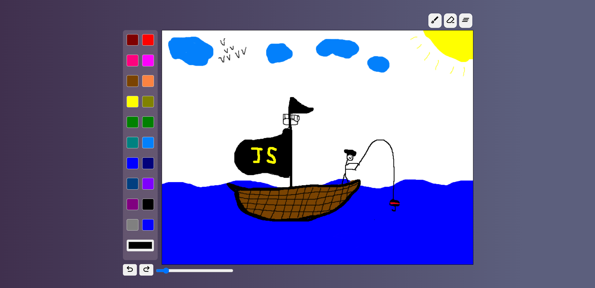

# Paint Web Application

Простое и удобное веб-приложение для рисования, созданное с использованием HTML, CSS и JavaScript. Этот проект позволяет пользователям рисовать, стирать и настраивать свои работы с помощью различных инструментов и функций.

---

## Функционал

### 🖌️ Инструменты рисования

- **Кисть**: Выбирайте разные цвета и толщину линии для свободного рисования.
- **Ластик**: Легко удаляйте части вашего рисунка.

### 🎨 Палитра цветов

- Готовые варианты цветов.
- Цветовой выбор для настройки пользовательских цветов.

### 🔄 Отмена и повтор

- Отмена последнего действия.
- Повтор ранее отмененных действий.

### 🧹 Очистка холста

- Быстрая очистка всего холста одной кнопкой.

### ⚙️ Настраиваемая толщина линии

- Ползунок для изменения размера кисти или ластика.

### 📱 Поддержка сенсорных экранов

- Полностью совместимо с устройствами с сенсорным экраном для рисования в дороге.

---

## Живая демо-версия

Посмотреть живую версию приложения можно [здесь](https://github.com/sanferq/paint-app.git).

---

## Скриншоты

### Основной интерфейс



### Пример рисунка



## Как начать

### Необходимые условия

Убедитесь, что у вас установлено следующее:

- Современный веб-браузер (например, Chrome, Firefox, Edge).

### Установка

1. Склонируйте репозиторий:
    
    ```bash
    git clone [https://github.com/your-username/paint-app.git](https://github.com/sanferq/paint.git)
    ```
    
2. Перейдите в папку проекта:
    
    ```bash
    cd paint-app
    ```
    
3. Откройте файл `index.html` в вашем браузере:
    
    ```bash
    open index.html
    ```

---

## Структура проекта

```
paint-app/
├── index.html       # Основной HTML файл
├── style.css        # Файл стилей
├── app.js           # Логика на JavaScript
├── img/             # Изображения (например, иконки)
├── screenshots/     # Скриншоты для README
└── README.md        # Документация
```

---

## Как пользоваться

1. Откройте приложение в вашем браузере.
2. Используйте кнопку **Кисть**, чтобы рисовать на холсте.
3. Выберите цвет из палитры или используйте выбор цвета.
4. Используйте **Ластик**, чтобы удалить части рисунка.
5. Настройте толщину линии с помощью ползунка.
6. Очищайте холст или отменяйте/повторяйте действия по мере необходимости.

---

## Используемые технологии

- **HTML5**: Для структуры веб-приложения.
- **CSS3**: Для стилизации приложения.
- **JavaScript**: Для интерактивных функций.

---

## Контакты

Свяжитесь с нами:

- **GitHub**: [@sanferq](https://github.com/sanferq)
- **Email**: [proselkinmaksim@gmail.com](mailto:proselkinmaksim@gmail.com)

